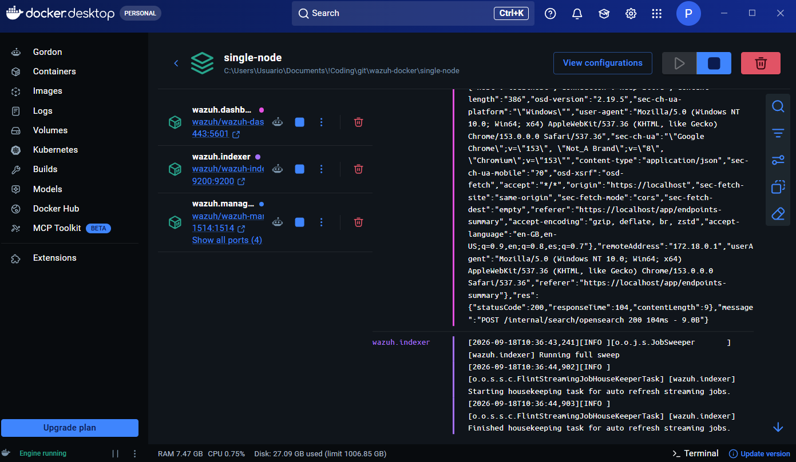
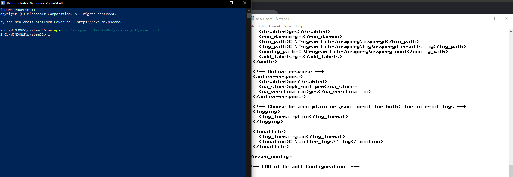
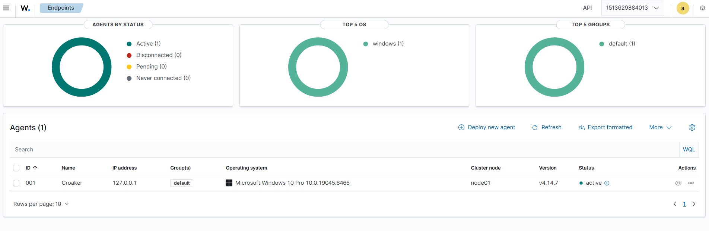
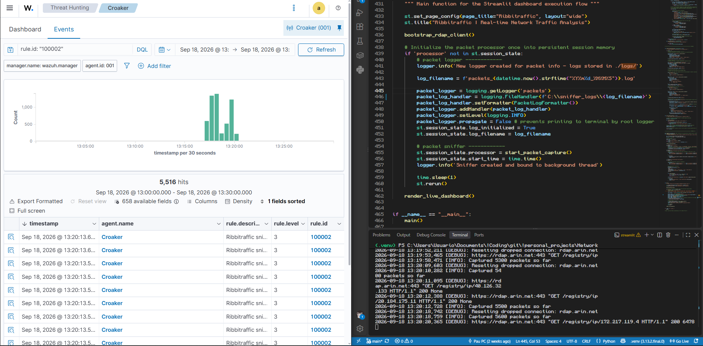

# Ribbitraffic

Local network traffic analysis tool to identify security patterns, detect anomalies, and ensure the security and efficiency of your local network

# Libraries Used

- **Streamlit** for the real-time dashboard frontend
- **Pandas** for the data processing
- **Scapy** for network packet capturing and packet processing
- **Plotly** for plotting charts with collected data
- [**Whoisit**](https://github.com/meeb/whoisit) for live asynchronous RDAP/ASN organizational registry queries over HTTPS 
- **Logging** to log and separate runtime terminal traces from structured packet JSON entries (`C:\sniffer_logs\`)

# Usage (local)

```
git clone <repo-url> <optional-name>
cd <project-folder>

pip install -r requirements.txt

streamlit run dashboard.py
```
If on Windows, **Npcap** must be installed to run
| Might have to be Admin Command Prompt (Windows) / sudo (Linux)

**Dashboard automatically refreshes every 1s, or you can manually refresh by pressing 'R'**

# Docker Usage - LINUX ONLY
Docker Desktop works differently on Windows, meaning it can never natively sniff packets on your wifi or ethernet card. Basically, the network is isolated for the container (like its own private network, and it can't access the real one outside the container)

### 1. Build the image by navigating to the root directory of the project folder and run:
```bash
docker build -t ribbitraffic .
```

### 2. Run the container to deploy the sniffer. This maps the Streamlit dashboard interface port, creates a persistent log directory on the host, and binds directly to the physical network stack:
```bash
docker run -d \
  --name ribbit-sniffer \
  --net=host \
  --cap-add=NET_ADMIN \
  -v /var/log/ribbitraffic:/app/logs \
  ribbitraffic
```

*   `--net=host`: Maps the container directly to the host's physical network routing table
*   `--cap-add=NET_ADMIN`: Grants root security capabilities to configure interface capture hooks
*   `-v`: Binds internal telemetry output straight onto the host's filesystem (`/var/log/`)

# Integrating with Wazuh

To scale this dashboard into an enterprise monitoring solution, I integrated Ribbitraffic with the **Wazuh SIEM / XDR platform**. The native Python script runs locally to capture hardware traffic, writes structured logs down to a local drive directory, and passes them to a containerized Wazuh cluster for the SIEM functions.

1. **Deploying the Stack via Docker:**
   I deployed the complete single-node Wazuh cluster (Manager, Indexer, and Dashboard) via Docker Compose.
   

2. **Deploying the Native Collection Agent:**
   I installed the native Windows Wazuh Agent on my host PC to monitor the logfiles on my local drive. I modified the agent’s configuration file (`ossec.conf`) to target the unified logging path and set it to match JSON formatting natively.
   

3. **Endpoints Activation:**
   I registered the local endpoint agent named **Croaker** and established a secure, authenticated TLS encryption tunnel back to the Docker manager container listening on localhost.
   

4. **Writing Custom Threat Rules:**
   I wrote custom detection rules inside `local_rules.xml` (forgot to take screenshot). I decided on these 3 simple rules for now:
   ```xml
   <group name="ribbitraffic,">

     <!-- base packet ingestion rule (just logging the fact a packet was captured) -->
     <rule id="100002" level="3">
       <decoded_as>json</decoded_as>
       <description>Ribbitraffic sniffer captured a network packet.</description>
     </rule>

     <!-- high-volume warning (when an unusual amount of data is transferred) -->
     <rule id="100003" level="7">
       <if_sid>100002</if_sid>
       <field name="size" type="number" greater_than="1500">\.+</field>
       <description>Ribbitraffic Warning: Large packet size detected.</description>
     </rule>

     <!-- ICMP/Ping scanning alert -->
     <rule id="100004" level="10">
       <if_sid>100002</if_sid>
       <protocol>ICMP</protocol>
       <description>Ribbitraffic Critical: ICMP network mapping detected.</description>
     </rule>

   </group>
   ```

5. **SIEM Telemetry Verification:**
   Once compiled, my custom Python fields successfully began parsing into indexable, searchable database columns inside the Wazuh Events dashboard view in real-time!
   


# Findings / Learning

Most of the TCP traffic is probably one of these categories:

Address type | Likely meaning
--- | ---
192.168.x.x	| Devices on your home network
10.x.x.x / 172.16–31.x.x | Private network devices
127.0.0.1 | Your own computer (localhost)
20.x.x.x & 52.x.x.x| Probably Microsoft
Public IPs | Internet servers (Google, Cloudflare, Microsoft, etc.)

**Note**: The script intentionally ignores any traffic from the ASN resolve requests, because if it included them, a large part of the traffic would be those HTTPS requests.

- Reverse DNS lookups can provide useful hostnames but many IP addresses don't expose reverse DNS records which results in unknown hostnames (like the Microsoft ones, probably... | or devices in your private network, since they have private IP addresses!)

    - Update: Added ASN priority lookup using whoisit - this happens before DNS lookup because it provides a more specific corporation/owner of the IP than DNS which can sometimes return generic or useless domain strings.

- Lots of different 5XXXX ports being used in my network -> ephemeral (temporary) ports assigned by my device's OS. Destination ports are generally more useful for identifying services such as HTTPS (443), DNS (53), etc.

- Using locks to prevent concurrency issues (in this case, sniff being a continuous packet getter, and the dashboard generating visualisations every 2 seconds from the processed packet data). I had already learned about this at uni through C/C++ concurrency, but doing it in Python refreshed some knowledge and actually let me apply it in a simple but useful scenario

    - Update: Seeing as the dashboard had to run the whole script again every 2 seconds, I refactored the code to rerun the visual components independently, and moved code that was previously in the global scope to other functions or classes to prevent bloating.

    - Another concurrency solution was moving the reverse-DNS lookup (and ASN lookup) to a separate thread for resolution, since whoisit uses HTTPS requests to get the data, and reverse-DNS also takes time.

- Streamlit is a nice data visualisation library! A lot more modern that MatPlotLib, but apparently less customisable...

- The way Docker Desktop is engineered on Windows prevents the containerised apps from reaching the host network, so Ribbitraffic won't work properly since it will only have access to the container's internal network

# Potential Next Steps

Lots of different things I can do over time to improve this "dashboard"

- **Malware Ingestion Profiles**: Configure signature scanning capabilities utilizing automated local YARA engine patterns.
- **Geographical IP Tracking**: Map external corporate target coordinates dynamically onto physical maps.
- **Machine Learning Anomaly Detection**: Build baseline behavioral profiles to flag abnormal packet spikes or data exfiltration attempts.
